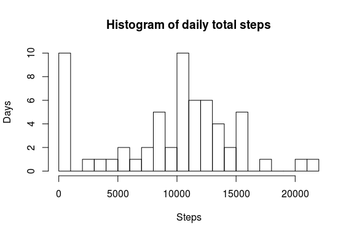
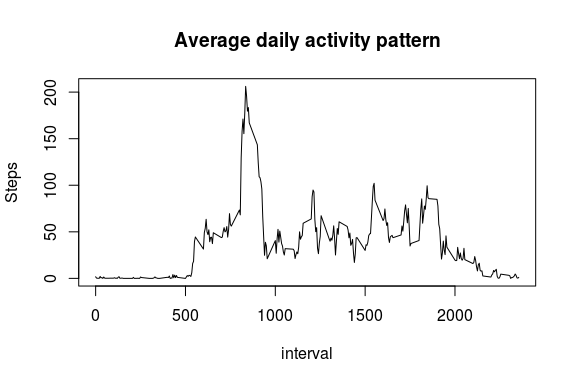
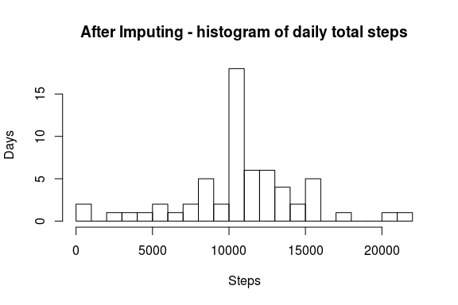
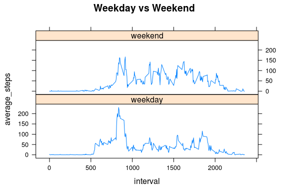

# Reproducible Research: Peer Assessment 1
## Loading and preprocessing the data


```r
# first we set some global options
knitr::opts_chunk$set(fig.width=6, fig.height=4, fig.path='figure/', dev='png',
                      echo=TRUE, warning=FALSE, message=FALSE)

# now we can extract and load the data
setwd("~/git/RepData_PeerAssessment1/")
unzip("activity.zip")
d <- read.csv("activity.csv", na.strings = c("NA"))
```

## What is mean total number of steps taken per day?


```r
# sum by date, removing NA
by_day <- aggregate(d$steps, list(date = d$date), sum, na.rm = T)
colnames(by_day)[[2]] <- "total_steps"
hist(by_day$total_steps, breaks = 20, xlab = "Steps", ylab= "Days", main = "Histogram of daily total steps")
```



```r
# find mean and median daily steps
summary(by_day$total_steps)
```

```
##    Min. 1st Qu.  Median    Mean 3rd Qu.    Max. 
##       0    6778   10400    9354   12810   21190
```

## What is the average daily activity pattern?

```r
# mean by interval, removing NA
by_interval <- aggregate(d$steps, list(interval = d$interval), mean, na.rm = T)
colnames(by_interval)[[2]] <- "average_steps"
with(by_interval, plot(interval, average_steps, ylab = "Steps", type = 'l', main = "Average daily activity pattern"))
```



```r
# find the interval with max average steps
by_interval[which.max(by_interval$average_steps),]
```

```
##     interval average_steps
## 104      835      206.1698
```

## Imputing missing values


```r
# find NA rows by inverting complete cases
sum(!complete.cases(d))
```

```
## [1] 2304
```

###Imputing with daily average for each interval


```r
# first join with interval average
d2 <- merge(d, by_interval, by='interval')

# replace any NA with the average
d2$steps <- ifelse(is.na(d2$steps), d2$average_steps, d2$steps)

# re-arrange the columns a bit
d2 <- d2[, c(3, 1, 2)]
```
###Daily total steps after imputing

```r
# sum by date
by_day_2 <- aggregate(d2$steps, list(date = d2$date), sum)
colnames(by_day_2)[[2]] <- "total_steps"
hist(by_day_2$total_steps, breaks = 20, xlab = "Steps", ylab= "Days", main = "After Imputing - histogram of daily total steps")
```



```r
# find new mean and median daily steps
summary(by_day_2$total_steps)
```

```
##    Min. 1st Qu.  Median    Mean 3rd Qu.    Max. 
##      41    9819   10770   10770   12810   21190
```

## Are there differences in activity patterns between weekdays and weekends?

```r
# first we assign weekday / weekend factor
d2$week <- as.factor(ifelse(weekdays(as.Date(as.character(d2$date))) %in% c('Saturday', 'Sunday'), 'weekend', 'weekday'))

# average of steps by interval and week day
by_interval_2 <- aggregate(d2$steps, list(interval = d2$interval, week = d2$week), mean)
colnames(by_interval_2)[[3]] <- "average_steps"

library(lattice)
xyplot(average_steps ~ interval | week, data = by_interval_2, type = 'l', layout = c(1, 2), main = 'Weekday vs Weekend')
```


